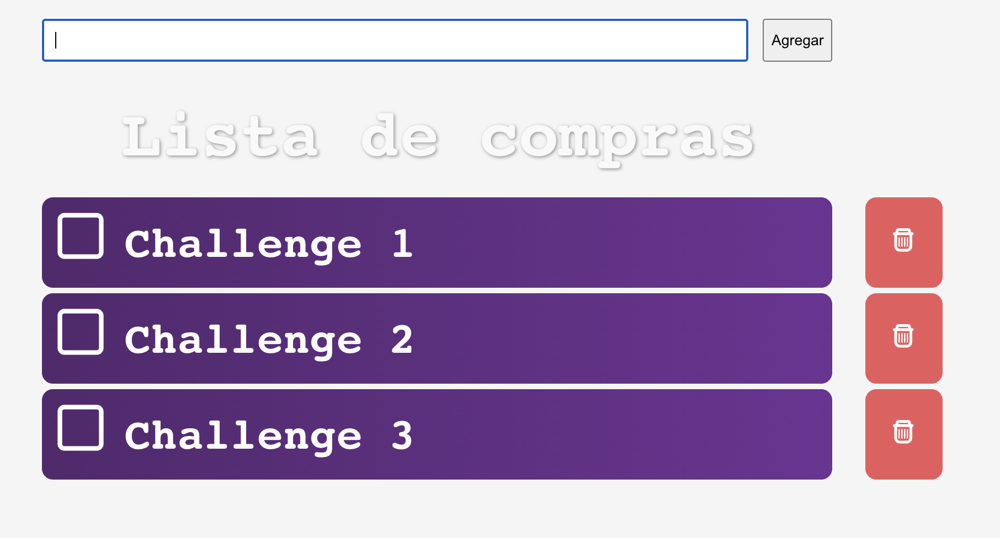
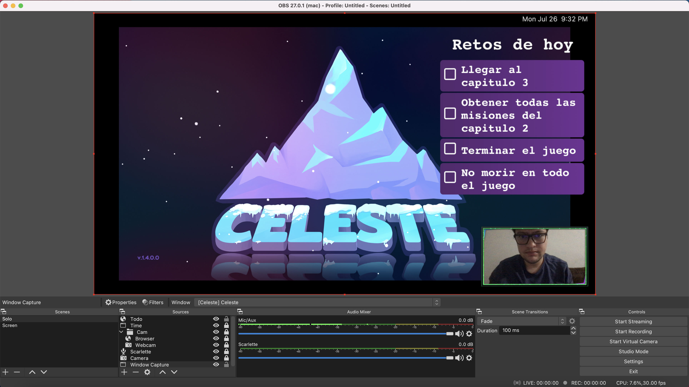

## Todo-Challenge for Streams

This is just a simple web app that you can insert into your streams for doing a todo challenge of the stream, I normally use it with Fortnite, where I set a couple challenges so my viewers can know what I'm doing as challenges for the stream.

What I do is to cut the input and delete button from the screen.

Remember that on OBS you can interact with the web page by clicking the interact button.

## Available Scripts

In the project directory, you can run:

### `yarn start`

Runs the app in the development mode.\
Open [http://localhost:3000](http://localhost:3000) to view it in the browser.

The page will reload if you make edits.\
You will also see any lint errors in the console.

##