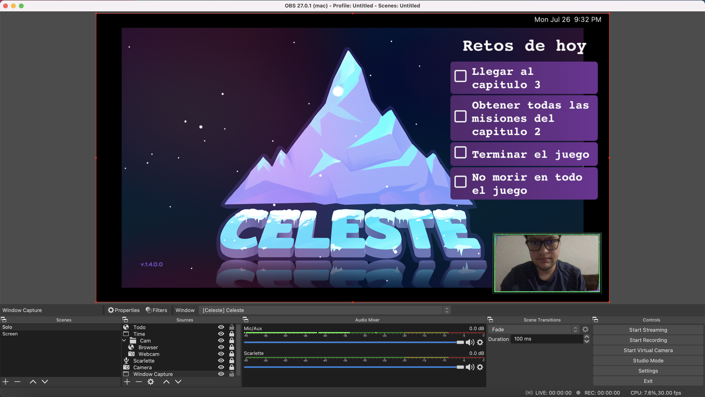

## Shoplist

Never forget what you need at the store again! 🛒✨





## Available Scripts

In the project directory, you can run:

### `yarn install`
install dependencies

### `yarn start`

Runs the app in the development mode.\
Open [http://localhost:3000](http://localhost:3000) to view it in the browser.

The page will reload if you make edits.\
You will also see any lint errors in the console.

##

## DEMO

https://shoplist-altyaper.netlify.app/

## AI photo import

Shoplist can extract shopping items from a photo of a handwritten list, receipt,
recipe, or groceries. Images are sent to a Netlify Function, which calls the
OpenAI Responses API without exposing the API key to the browser.

Add the OpenAI key as an encrypted GitHub Actions secret named
`OPENAI_API_KEY`. On every push to `master`, the deployment workflow syncs that
secret into Netlify's protected function environment before deploying.

```bash
gh secret set OPENAI_API_KEY --repo altyaper/shoplist
```

For local development, copy `.env.example` to `.env` and add a development key.
JPEG, PNG, and WebP images up to 4 MB are accepted. Detected items are always
shown for review before they are added to local storage.